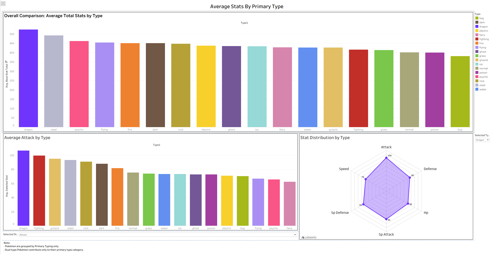
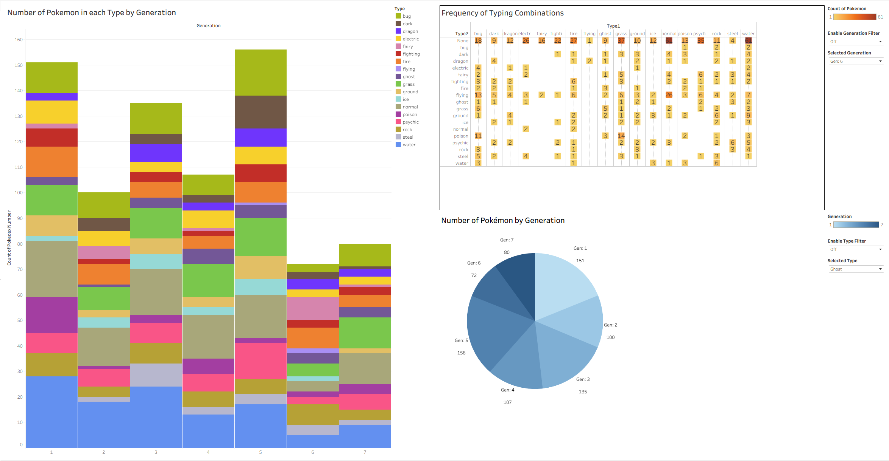

**Pokémon Data Analysis Project**

Tableau Public Link: https://public.tableau.com/views/pokemon_visualization/StatsbyPrimaryType?:language=en-US&:sid=&:redirect=auth&:display_count=n&:origin=viz_share_link

NOTE: Only includes the Pokémon from the first 7 Generations (Not including megas and different forms)   
      Ultra Beasts and Mythical Pokemon will be counted as legendaries as well

**Project Process**

1. Clean the Data in Excel to get rid of non-needed data  
	a. Got rid of Japanese Names  
	b. Cleaned name so there are no symbols for male and female (This is needed so the data can be used in MySQL (They don't like special characters))  

2. Imported to SQL for more Data Cleaning  
   a. Removed Duplicates  
   b. Standardized the Data  
   c. Null Values or Blank values  
   d. Removed Any Columns  
   e. Reordered Columns (Better readability)  
   f. Added mythics and ultra beast columns + made sure their classifications are right

3. Data Exploratory Analysis and Visualization in Tableau  
   a. Created a Dashboard that shows all the average stats for each type  
      - Dragon type has the highest stats based on total stats, but Dragon is also always in the top 3 in every other individual stat  
      - Bug is the lowest total stat and seems to be at the bottom of most graphs
  
     

   b. Created a Dashboard that shows information about pokemon across the 7 generation
      - Number of each type in corresponding generation  
      - Frequency of type combinations  
      - Number of pokemon in each generation  
        
     

  
4. TODO - Answer different questions that the dashboard and charts answer  

**Credits**
Data gotten from https://www.kaggle.com/datasets/rounakbanik/pokemon  